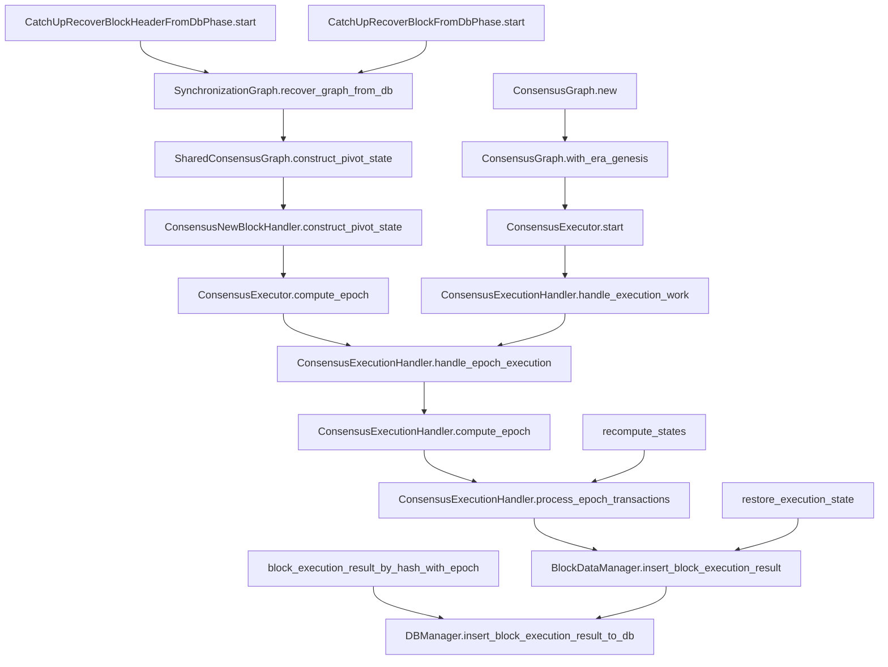

# 针对现有tx执行错误和不打包情况的处理方案
tx 当前主要有两个问题待解决
1. tx不打包
2. tx打包了但交易失败

## 不打包的情况
针对不打包的情况建议新增一个rpc cfx_diagnoseTransactionByHash

## tx打包了但交易失败
分两种

### 未打包时的error （已实现）
如nonce太低，太高，epochheight不对等情况
直接返回jsonrpc error

### 打包但失败的error
打包但失败后我们应该将其存储到db中，可以供rpc获取

#### 存储receipt error
由于receipt error属于receipt附属信息，所以考虑将其与receipt一样存储到Blocks表，对key增加相应的suffix byte

- table:Blocks 
- suffix:BLOCK_EXECUTION_RESULT_ERROR_SUFFIX_BYTE: u8 = 9

##### Rlp编码
这里还在看是否需要自己实现Receipt Error的Rlp encode/decode实现

##### 变长error的处理
vm error中不定长的信息有以下三种, 根据是否可控考虑是否做长度限制：

1. InternalContract(&'static str)，由于这个是我们官方创建的，str长度可控，所以不限制长度
2. Wasm(String),这个应该是webassembly抛出的，但不知str长度是否可控，暂时不限制长度
3. BuiltIn(&'static str),这个为了防止错误信息太长，导致0成本消耗节点存储的攻击，考虑最多存储一定量(32?)字节

#### 读取receipt error
在rpc.types.Receipt结构体中增加字段 outcome_error: null 或 error 字符串

在cfx_getTransactionReceipt时返回携带outcome_error的Receipt

# ExecutionOutcome
```rust
// file: core/src/executive/executed.rs
#[derive(Debug)]
pub enum ExecutionOutcome {
    NotExecutedDrop(TxDropError),
    NotExecutedToReconsiderPacking(ToRepackError),
    ExecutionErrorBumpNonce(ExecutionError, Executed),
    Finished(Executed),
}
```
## Executed, ToRepackError, TxDropError, ExecutionError
```rust
// file: core/src/executive/executed.rs
#[derive(Debug, PartialEq, Clone)]
pub struct Executed {
    /// Gas used during execution of transaction.
    pub gas_used: U256,

    /// Fee that need to be paid by execution of this transaction.
    pub fee: U256,

    /// Gas charged during execution of transaction.
    pub gas_charged: U256,

    /// If the gas fee is born by designated sponsor.
    pub gas_sponsor_paid: bool,

    /// Vector of logs generated by transaction.
    pub logs: Vec<LogEntry>,

    /// If the storage cost is born by designated sponsor.
    pub storage_sponsor_paid: bool,

    /// Any accounts that occupy some storage.
    pub storage_collateralized: Vec<StorageChange>,

    /// Any accounts that release some storage.
    pub storage_released: Vec<StorageChange>,

    /// Addresses of contracts created during execution of transaction.
    /// Ordered from earliest creation.
    ///
    /// eg. sender creates contract A and A in constructor creates contract B
    ///
    /// B creation ends first, and it will be the first element of the vector.
    pub contracts_created: Vec<Address>,
    /// Transaction output.
    pub output: Bytes,
}

#[derive(Debug)]
pub enum ToRepackError {
    /// Returned when transaction nonce does not match state nonce.
    InvalidNonce {
        /// Nonce expected.
        expected: U256,
        /// Nonce found.
        got: U256,
    },

    /// Epoch height out of bound.
    /// The transaction was correct in the block where it's packed, but
    /// falls into the error when in the epoch to execute.
    EpochHeightOutOfBound {
        block_height: u64,
        set: u64,
        transaction_epoch_bound: u64,
    },

    /// Returned when cost of transaction (value + gas_price * gas) exceeds
    /// current sponsor balance.
    NotEnoughCashFromSponsor {
        /// Minimum required gas cost.
        required_gas_cost: U512,
        /// Actual balance of gas sponsor.
        gas_sponsor_balance: U512,
        /// Minimum required storage collateral cost.
        required_storage_cost: U256,
        /// Actual balance of storage sponsor.
        storage_sponsor_balance: U256,
    },

    /// Returned when a non-sponsored transaction's sender does not exist yet.
    SenderDoesNotExist,
}

#[derive(Debug)]
pub enum TxDropError {
    /// The account nonce in world-state is larger than tx nonce
    OldNonce(U256, U256),

    /// The recipient of current tx is in invalid address field.
    /// Although it can be verified in tx packing,
    /// by spec doc, it is checked in execution.
    InvalidRecipientAddress(Address),
}

#[derive(Debug)]
pub enum ExecutionError {
    /// Returned when cost of transaction (value + gas_price * gas) exceeds
    /// current sender balance.
    NotEnoughCash {
        /// Minimum required balance.
        required: U512,
        /// Actual balance.
        got: U512,
        /// Actual gas cost. This should be min(gas_fee, balance).
        actual_gas_cost: U256,
        /// Maximum storage limit cost.
        max_storage_limit_cost: U256,
    },
    /// Contract already exists in the specified address.
    ContractAddressConflict,
    VmError(vm::Error),
}

```
## VM::Error

```rust
// file: core/src/vm/error.rs
/// VM errors.
#[derive(Debug, PartialEq)]
pub enum Error {
    /// `OutOfGas` is returned when transaction execution runs out of gas.
    /// The state should be reverted to the state from before the
    /// transaction execution. But it does not mean that transaction
    /// was invalid. Balance still should be transfered and nonce
    /// should be increased.
    OutOfGas,
    /// `BadJumpDestination` is returned when execution tried to move
    /// to position that wasn't marked with JUMPDEST instruction
    BadJumpDestination {
        /// Position the code tried to jump to.
        destination: usize,
    },
    /// `BadInstructions` is returned when given instruction is not supported
    BadInstruction {
        /// Unrecognized opcode
        instruction: u8,
    },
    /// `StackUnderflow` when there is not enough stack elements to execute
    /// instruction
    StackUnderflow {
        /// Invoked instruction
        instruction: &'static str,
        /// How many stack elements was requested by instruction
        wanted: usize,
        /// How many elements were on stack
        on_stack: usize,
    },
    /// When execution would exceed defined Stack Limit
    OutOfStack {
        /// Invoked instruction
        instruction: &'static str,
        /// How many stack elements instruction wanted to push
        wanted: usize,
        /// What was the stack limit
        limit: usize,
    },
    /// `SubStackUnderflow` when there is not enough stack elements to execute
    /// a subroutine return
    SubStackUnderflow {
        /// How many stack elements was requested by instruction
        wanted: usize,
        /// How many elements were on stack
        on_stack: usize,
    },
    /// When execution would exceed defined subroutine Stack Limit
    OutOfSubStack {
        /// How many stack elements instruction wanted to pop
        wanted: usize,
        /// What was the stack limit
        limit: usize,
    },
    InvalidSubEntry,
    /// When balance is not enough for `collateral_for_storage`.
    /// The state should be reverted to the state from before the
    /// transaction execution.
    NotEnoughBalanceForStorage {
        required: U256,
        got: U256,
    },
    /// `ExceedStorageLimit` is returned when the `collateral_for_storage`
    /// exceed the `storage_limit`.
    ExceedStorageLimit,
    /// Built-in contract failed on given input
    BuiltIn(&'static str),
    /// Internal contract failed
    InternalContract(&'static str),
    /// When execution tries to modify the state in static context
    MutableCallInStaticContext,
    /// Error from storage.
    StateDbError(PartialEqWrapper<DbError>),
    /// Wasm runtime error
    Wasm(String),
    /// Out of bounds access in RETURNDATACOPY.
    OutOfBounds,
    /// Execution has been reverted with REVERT.
    Reverted,
    /// Invalid address
    InvalidAddress(Address),
}
```

代码路径 

